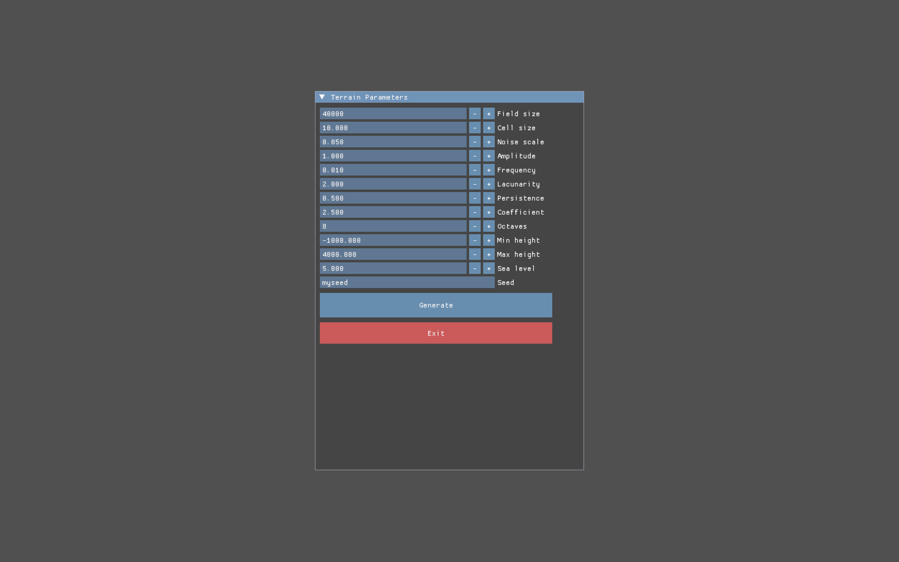
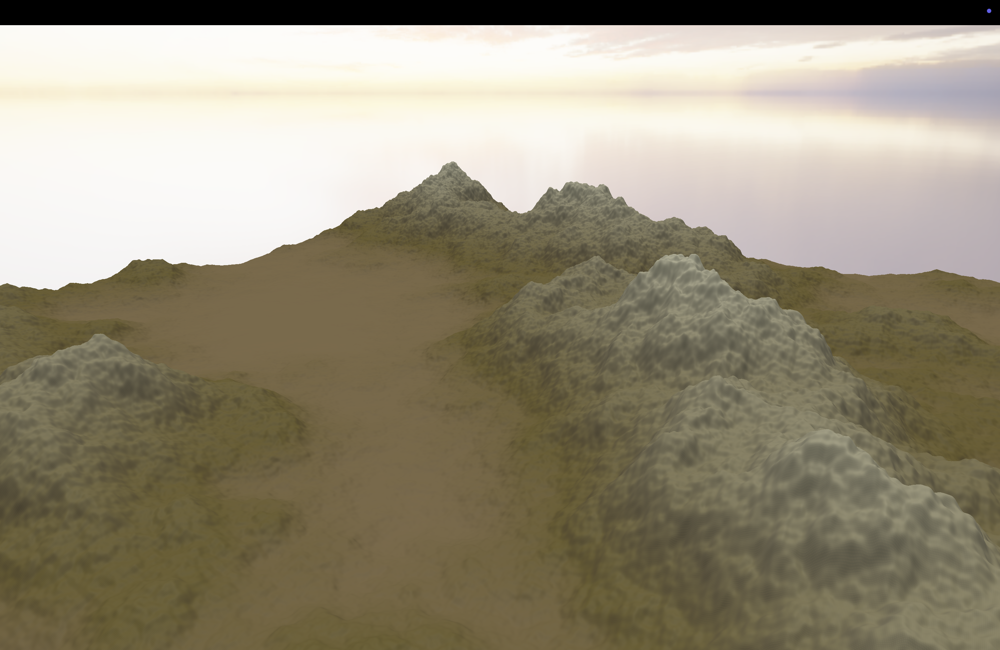
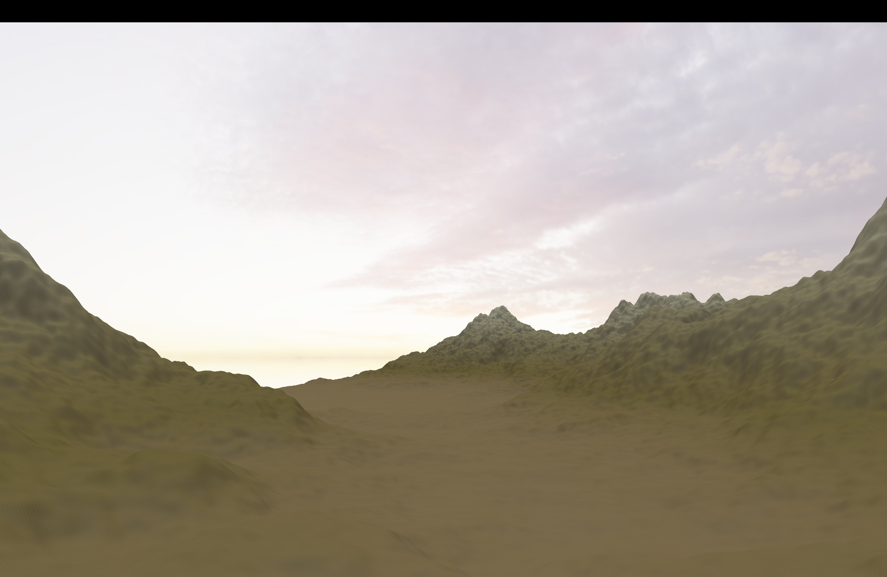
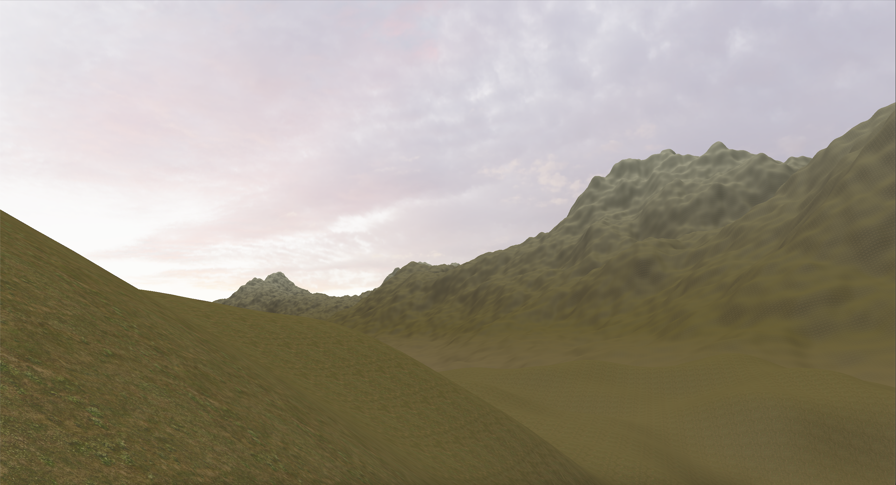

# TerrainGen

Procedural 3D terrain generator built with C++ and OpenGL.






## Features

- Procedural terrain generation using Fractal Brownian Motion over Perlin Noise
- Real-time 3D rendering with OpenGL
- Texture splatting (grass, rock, snow, sand, swamp) based on height and slope
- HDR skybox from panoramic cubemap
- Phong/Blinn-Phong lighting
- Multithreaded generation with live progress bar
- ImGui parameter menu — tweak and regenerate without restarting
- Free camera (WASD + mouse)

## Parameters

| Parameter | Description |
|-----------|-------------|
| Field size | Total terrain size in units |
| Cell size | Distance between vertices |
| Noise scale | Scale of the noise input |
| Amplitude | Base height multiplier |
| Frequency | Base noise frequency |
| Lacunarity | Frequency multiplier per octave |
| Persistence | Amplitude multiplier per octave |
| Coefficient | Additional height scaling |
| Octaves | Number of noise layers |
| Min/Max height | Height clamp range |
| Sea level | Water plane height |
| Seed | String or numeric seed |

## Controls

| Key | Action |
|-----|--------|
| W A S D | Move camera |
| Mouse | Look around |
| Space | Move up |
| Left Shift | Move down |
| ESC | Return to menu |

## Building from source

**Dependencies:** CMake 3.16+, GLFW3, TBB, OpenMP (via Homebrew on macOS)

```bash
brew install glfw tbb llvm
cmake -B build -DCMAKE_BUILD_TYPE=Release
cmake --build build
./build/TerrainGen
```

## macOS Bundle

To build a portable `.app`:

```bash
./bundle.sh
```
## Download

See [Releases](../../releases) for a prebuilt macOS binary.

## Running on macOS

Download `TerrainGen-macos.zip` from [Releases](../../releases), unzip, then:

```bash
# Remove quarantine flag (required for unsigned apps)
xattr -cr TerrainGen.app

# Run
./TerrainGen.app/Contents/MacOS/TerrainGen
```

Or right-click `TerrainGen.app` in Finder → Open → Open.

Output: `TerrainGen.app` — runs without Homebrew installed.
